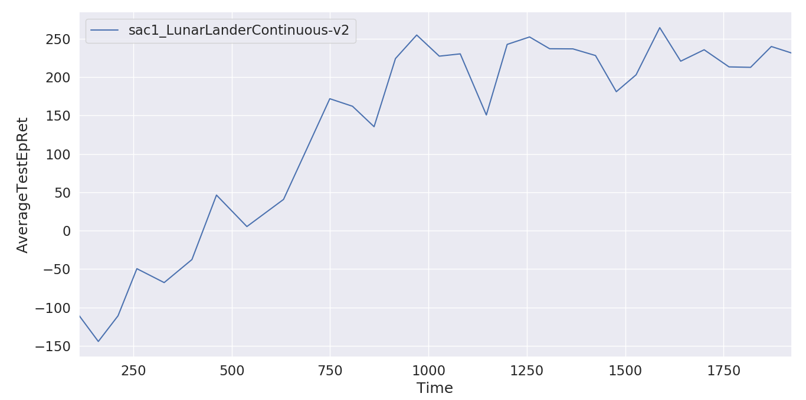

# Distributed-DRL
Distributed Deep Reinforcement Learning

This framework inspired by general-purpose RL training system **Rapid** from OpenAI.

Rapid framework:

Our framework:


---

Tutorial

- [Parallelize your algorithm by Ray (1)](tutorial/Parallelize%20your%20algorithm%20by%20Ray%20(1).md)
- [Parallelize your algorithm by Ray (2)](tutorial/Parallelize%20your%20algorithm%20by%20Ray%20(2).md)
- [Parallelize your algorithm by Ray (3)](tutorial/Parallelize%20your%20algorithm%20by%20Ray%20(3).md)

---

This framework divides the reinforcement learning process into five parts:

- Replay buffer (option)
- Parameter server
- train (learn)
- rollout
- test

```python
@ray.remote
class ReplayBuffer:
	...
    # replay buffer
    
@ray.remote
class ParameterServer(object):
	...
    # keep the newest network weights here
    # could pull and push the weights
    # also could save the weights to local
    
@ray.remote(num_gpus=1, max_calls=1)
def worker_train(ps, replay_buffer, opt, learner_index):
    ...
    # build a learner network
    # pull weights from ps
  	# for loop:
    #	get sample batch from replaybuffer
    #	update network and push new weights to ps
    
@ray.remote
def worker_rollout(ps, replay_buffer, opt, worker_index):
    ...
    # bulid a rollout network
    # pull weights from ps
    # for loop:
    #	interactive with environment
    #	store experience to replay buffer
    #	if end of episode:
    #		pull weights from ps
    
@ray.remote
def worker_test(ps, replay_buffer, opt, worker_index=0):
    ...
    # bulid a test network usually same as rollout
    # while:
    #	pull weights from ps
    #	do test
    #	might save model here
    
if __name__ == '__main__':

    ray.init(object_store_memory=1000000000, redis_max_memory=1000000000)

    opt = HyperParameters(FLAGS.env_name, FLAGS.total_epochs, FLAGS.num_workers)

    # create the parameter server
    if FLAGS.is_restore == "True":
        ps = ParameterServer.remote([], [], is_restore=True)
    else:
        net = Learner(opt, job="main")
        all_keys, all_values = net.get_weights()
        ps = ParameterServer.remote(all_keys, all_values)

    # create replay buffer
    replay_buffer = ReplayBuffer.remote(obs_dim=opt.obs_dim, act_dim=opt.act_dim, size=opt.replay_size)

    # Start some rollout tasks.
    task_rollout = [worker_rollout.remote(ps, replay_buffer, opt, i) for i in range(FLAGS.num_workers)]

    time.sleep(5)
	
	# start training tasks
    task_train = [worker_train.remote(ps, replay_buffer, opt, i) for i in range(FLAGS.num_learners)]

    # start testing
    task_test = worker_test.remote(ps, replay_buffer, opt)

    # wait util task test end
    # Keep the main process running. Otherwise everything will shut down when main process finished.
    ray.wait([task_test, ])
```


### Result:

Env: LunarLanderContinuous-v2
GPU:GTX1060 x1

**SAC1 without distribution:** gets 200+ in 1200s

**Distributed SAC1:** gets 200+ in 360s

